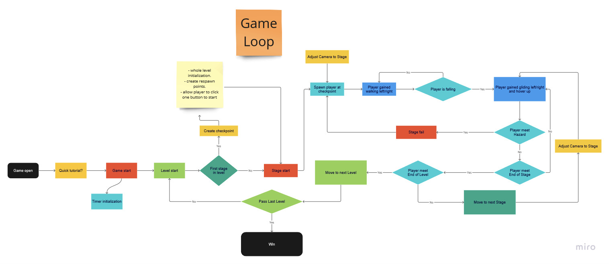

# Game Basic Information #

## Summary ##

**A paragraph-length pitch for your game.** 
Help! The princess has fallen and has gotten stuck in a cave! It is your job, the Brave Knight, to go and save her. As you are falling through the skies, maneuver through platforms and enemies as they try to knock you off your path. Be careful! The land can change from freezing cold to scorching hot. Go save the princess and don't give up on this upcoming journey.  

## Gameplay Explanation ##

**In this section, explain how the game should be played. Treat this as a manual within a game. It is encouraged to explain the button mappings and the most optimal gameplay strategy.**

**If you did work that should be factored in to your grade that does not fit easily into the proscribed roles, add it here! Please include links to resources and descriptions of game-related material that does not fit into roles here.**
* [Gameplay Programmer](https://www.screenskills.com/job-profiles/browse/games/programming/gameplay-programmer/) - Work on objects (prefabs) that interacts with the game world and player. Assist level designer with creating fun objects, while also tuning and balancing their effects.
* [AI Programmer](https://www.screenskills.com/job-profiles/browse/games/programming/artificial-intelligence-ai-programmer/) - Work on enemies to create exciting adversaries for the player. Balance npc and the player with the level designer to deliver fun interactions. 
* [Level Design](https://www.screenskills.com/job-profiles/browse/games/design/level-designer/) - Work on designing the levels of the game which takes into account platforms, enemies, objects etc. 
# Main Roles #

Your goal is to relate the work of your role and sub-role in terms of the content of the course. Please look at the role sections below for specific instructions for each role.

Below is a template for you to highlight items of your work. These provide the evidence needed for your work to be evaluated. Try to have at least 4 such descriptions. They will be assessed on the quality of the underlying system and how they are linked to course content. 

*Short Description* - Long description of your work item that includes how it is relevant to topics discussed in class. [link to evidence in your repository](https://github.com/dr-jam/ECS189L/edit/project-description/ProjectDocumentTemplate.md)

Here is an example:  
*Procedural Terrain* - The background of the game consists of procedurally-generated terrain that is produced with Perlin noise. This terrain can be modified by the game at run-time via a call to its script methods. The intent is to allow the player to modify the terrain. This system is based on the component design pattern and the procedural content generation portions of the course. [The PCG terrain generation script](https://github.com/dr-jam/CameraControlExercise/blob/513b927e87fc686fe627bf7d4ff6ff841cf34e9f/Obscura/Assets/Scripts/TerrainGenerator.cs#L6).

You should replay any **bold text** with your relevant information. Liberally use the template when necessary and appropriate.

## Producer

### Student Information
*Name: Rijul Saxena*   
*Email: rsax@ucdavis.edu*   
*Github: rsax1*

Our team realized early in the production process that our varying schedules would make it hard to pair-program and meet regularly until later in the quarter. In lieu of regular meetings, we made sure to clearly define tasks within the development process and created a Discord group chat as a "drop in" space, where team members would start calls when needed for decision making and debugging. This worked well for us because it was rare that an issue or decision required all hands on deck. 

Some roles had to wait for others before they could begin their work (which was reflected on our original Gantt chart), so those waiting to start their role's task acted as floating helpers to whoever was in progress with their task. Our major logistical issue arose while designing the main player's movement, since we had not fully figured out how we wanted that mechanism to work in relation to the rest of the game. At one point, there was confusion between within the team regarding how to best accomplist the desired player movement feel, and we ended up with two scripts from two authors. We as a team value each member's contribution, so instead of voting or making a hasty descision for which script to use, we deliberated as a team to understand the differences between the two files and hopped on a long call to combine their strengths. 

Organizing and managing the repository was not a struggle for us, since a convention for the structure of the game components was agreed upon beforehand, and clarification was shared continually throughout the development process. One great aspect of our workflow was to only push changes when something was fixed or improved, and to notify the team groupchat when a push to the repo was made (so that others could check for conflicts or be ready to pull before adding their own changes)

## User Interface

### Student Information
*Name: Jehryn Rillon*   
*Email: jmrillon@ucdavis.edu*   
*Github: jmo-gh*

### Menus
Several menus were implemented into Fall King. Menus were implemented as their own scene or as an overlay above `Stages`, our gameplay scene. Scenes are loaded through Unity's Scene Manager using a predefined build order, with the exception of overlayed menus being loaded by name.

#### Main Menu
The main menu (viewable in the `MainMenu` scene) consists of three buttons: [Play](https://github.com/CyberExplosion/Fall-King/blob/5ef40d1162ed6164906d221db77a068eeaa471ec/FallKing/Assets/Scripts/MainMenu.cs#L6), [How to Play](https://github.com/CyberExplosion/Fall-King/blob/f2a0007c1a618ef50166676bc54c587740e284ed/FallKing/Assets/Scripts/MainMenu.cs#L11), and [Quit](https://github.com/CyberExplosion/Fall-King/blob/5ef40d1162ed6164906d221db77a068eeaa471ec/FallKing/Assets/Scripts/MainMenu.cs#L11). The `Play` button uses Unity's Scene Manager to open the next scene in the build index, as defined in the project's build settings. The `How to Play` button loads the `HowToPlay` scene containing information about game mechanics. Lastly, the `Quit` button simply exits the application.

The UI panels (the background panels for the buttons) were made using a generic 9-spliced white 8 bit sprite, allowing us to reuse the same sprite for various sizes without losing proportioinality. By adjusting the thresholds for the 9-splice within Unity's Sprite Editor and testing different `Pixels per Unit` for the sprite, we were able to achieve the pixel-art like look for the panels.

All other menus within our game are created using the same method since we are able to resize the UI panel as needed.

We also added an infinite scrolling background to the main menu to give the main menu a little more life. This was accomplished within [Scroller.cs](https://github.com/CyberExplosion/Fall-King/blob/b11fed4f26b5265db5a136b9f1315499957421a8/FallKing/Assets/Scripts/Scroller.cs#L1) which is attached to `GameObject Background` within the `MainMenu` scene. The scroll effect is achieved by slightly moving the texture coordinates of the background image based on the given `float x` and `float y` fields of the Scoller script. These values are also multiplied to the new coordinates in conjunction with `Time.deltaTime` to ensure smooth scroll movement.

See the `Resources Used` section for inspiration on the Main Menu implementation.

#### How to Play Menu
The How to Play menu (viewable in the `HowToPlay` scene) consists of core gameplay mechanics as well as tips/lore about the game and a [Back](https://github.com/CyberExplosion/Fall-King/blob/f2a0007c1a618ef50166676bc54c587740e284ed/FallKing/Assets/Scripts/HowToPlay.cs#L8) button that loads the `MainMenu` scene, bringing the player back to the main menu using Unity's Scene Manager.

The design of the How to Play menu was based on the design of main menu, see `Resources Used` for inspiration.

#### Pause Menu
Pausing the game consists of setting Unity's `Time.timeScale` to `0` which stops the flow of time within the `Stages` scene. An `Input Action` called `PauseAction` listens for the user to input `Esc` before invoking [PauseGame()](https://github.com/CyberExplosion/Fall-King/blob/5ef40d1162ed6164906d221db77a068eeaa471ec/FallKing/Assets/Scripts/PauseManager.cs#L44) which is responsible for setting `Time.timeScale` to `0`, setting a `boolean paused` to `true` and enabling the `Canvas` component named `Menu` which holds the UI of the pause menu.

The pause menu (viewable by pressing `Esc` during gameplay) consists of two buttons: [Resume](https://github.com/CyberExplosion/Fall-King/blob/5ef40d1162ed6164906d221db77a068eeaa471ec/FallKing/Assets/Scripts/PauseManager.cs#L53) and [Give Up](https://github.com/CyberExplosion/Fall-King/blob/5ef40d1162ed6164906d221db77a068eeaa471ec/FallKing/Assets/Scripts/PauseManager.cs#L61). The `Resume` button unfreezes the scene by setting `Time.timeScale` back to `1`, setting the `boolean paused` to `false`, and disabling the `Menu` component from being displayed. The `Give Up` button does the exact opposite of the `Resume` button and loads the `MainMenu` scene.

After the core functionality of the pause menu was implemented, we noticed that the ongoing audio was stilly playing even after pausing the game. We soon discovered that Audio was unaffected by `Time.timeScale` so we had to directly access Unity's `AudioListener` and setting its `pause` field to `true` and `false` within `PauseGame()` and `ResumeGame()`.

Lastly, in order to assign functionality to these buttons we had to create an empty `GameObject PauseSystem` which we then assigned the `PauseManager.cs` script to. Then in Unity's Inspector window for each button, assign each `onClick()` to its respective `PauseGame()` and `ResumeGame()` function.

The design of the pause menu was based on the design of main menu, see `Resources Used` for inspiration.

#### Victory Menu
The victory menu (viewable when player collides with Princess) consists of a button [Return Home](https://github.com/CyberExplosion/Fall-King/blob/702af631bc49e0b5cd21c61c89789b4d5b1fffa9/FallKing/Assets/Scripts/PauseManager.cs#L61) and a UI panel with a informing the player that they have rescued the Princess. The Return Home button uses the same `onClick()` event as the pause menu's Give Up button since they both return the player to the main menu. 

Similar to the pause menu, the victory menu is a `Canvas` object that overlays on top of the camera and by default is disabled. The script [VictoryManager.cs](https://github.com/CyberExplosion/Fall-King/blob/702af631bc49e0b5cd21c61c89789b4d5b1fffa9/FallKing/Assets/Scripts/VictoryManager.cs#L1) is attached to the `GameObject Princess` and monitors when a collision is made with the player. This collision then enables the Victory Menu canvas and overlays the UI on screen.

The design of the victory menu was based on the design of main menu, see `Resources Used` for inspiration.

### Other UI Elements

#### Stage Name Overlay
When the player enters a new stage (goes from Level `1-3` to `2-1`, or `3-3` to `4-1`) a text overlay appears on the screen with the name of the stage. Not only does this text overlay serve as a visual checkpoint for the player, but it also gives insight into the particular challenges that the player will face that stage.

The text overlay was achieved by first creating a `Canvas` to attach a `TextMeshPro` component to as a child. The `Canvas` is then attached to the `Main Camera` by changing the `Render Mode` to `Screen Space - Camera` in the Inspector window of the `Canvas` component. Then, the `TextMeshPro` component is aligned  vertically and horizontally within the `Canvas` to center the text on the screen.

In order to properly display the text overlay when the player enters a new stage, a script [StageNameOverlay.cs](https://github.com/CyberExplosion/Fall-King/blob/5ef40d1162ed6164906d221db77a068eeaa471ec/FallKing/Assets/Scripts/StageNameOverlay.cs#L1) is attached to the `LevelBoundary` of the last level of each stage. `StageNameOverlay.cs` takes two `Serialized Fields` as input: the `TextMeshPro` UI component and a `string` text value that will be overlayed on the screen. Once the `Player` game object collides with the `LevelBoundary` we access the `TextMeshPro` UI component's text field and update it accordingly to the passed `string` text value.

However, just displaying the stage name didn't give off the retro platformer feel we were hoping for. So instead of immediately displaying the stage name on the screen, we decided to give the text overlay some life and apply a typewriter animation. The stage name is displayed letter by letter, giving off that retro vibe due to its association with older technology and nostalgic aesthetics. 

Implementing the typewriter animation required the use of a `Coroutine`, specifically [IEnumerator TypeStageName()](https://github.com/CyberExplosion/Fall-King/blob/5ef40d1162ed6164906d221db77a068eeaa471ec/FallKing/Assets/Scripts/StageNameOverlay.cs#L30). `TypeStageName()` uses a `foreach` loop to add each character of the `string` text value to the `TextMeshPro` UI component. After each iteration, a delay of `float typingSpeed` is applied to control the speed at which the text appears on screen. Then after all characters are written out, a delay of `float animationLength` is applied to control how long before a reverse typewriter animation is applied to remove each character from the `TextMeshPro` UI component one at a time. Similar to the addition of each character, there is a delay of `float typingSpeed` to control the speed at which characters are removed from the screen.

`TypeStageName()` is invoked via `StartCoroutine()` in the function [StartTyping()](https://github.com/CyberExplosion/Fall-King/blob/5ef40d1162ed6164906d221db77a068eeaa471ec/FallKing/Assets/Scripts/StageNameOverlay.cs#L20). This function checks that a `Coroutine` for `TypeStageName()` doesn't already exist before invoking it.

Lastly, `StartTyping()` is called once the `Player` object collides with the `LevelBoundary` which we check in the [OnTriggerEnter2D](https://github.com/CyberExplosion/Fall-King/blob/5ef40d1162ed6164906d221db77a068eeaa471ec/FallKing/Assets/Scripts/StageNameOverlay.cs#L47).

#### Resources Used
[Main Menu](https://www.youtube.com/watch?v=IuuKUaZQiSU)    
[Pause Menu](https://www.youtube.com/watch?v=9tsbUoFfAgo&t=759s)    
[Unity Canvas docs](https://docs.unity3d.com/Packages/com.unity.ugui@1.0/manual/UICanvas.html)

## Movement/Physics

**Describe the basics of movement and physics in your game. Is it the standard physics model? What did you change or modify? Did you make your movement scripts that do not use the physics system?**

### Player Controller
* Describe how to make player feel snappy and smooth when moving
* Describe how player expect to interact with many different prefab around them

## Animation and Visuals

### Student Information
*Name: Rijul Saxena*   
*Email: rsax@ucdavis.edu*   
*Github: rsax1*

To build a world for our game, we drew inspiration from 2D platformers, like the Mario games and Jump King. Our narrative design follows a knight moving deeper and deeper through obstacles in search of his princess. We have multiple Biomes divided between our stages and levels, including forests, underground caves, cold tundras, and volcanic terrain. In order to match these requirements, the Unity Asset Store was a key resource for us to get all of our visuals. 
 
* Knight, clouds, plants, extra terrain elements: https://assetstore.unity.com/packages/2d/environments/flat-platformer-template-108101
* Terrain Tiles: https://assetstore.unity.com/publishers/48778
* Icy visuals: https://assetstore.unity.com/packages/2d/environments/2d-ice-world-106818
* Magnets and other obstacles: https://assetstore.unity.com/packages/2d/characters/pixel-adventure-1-155360

We went through many iterations of asset themes for this project. Initially we thought of sticking to a medieval theme to match our main character, the knight, but instead decided as a team that we wanted more variety and color for a more interesting game feel. To achieve this, we decided on varying terrain types and imported assets according to our narrative plan. It was easy to find sprites for our forest biome, and eventually made tile palettes for the caves and cold weather stages with smaller asset packs. One issue that came up during the importing process was sizing and gameplay interaction, so a recurring topic during team meetings was sizing and assigning mass to elements of our game's world should be in relation to the man character.

## Input - AI Programmer - Gameplay Programmer
### Student Information
*Name: Khoi Nguyen* \
*Email: koinguyen@ucdavis.edu*  \
*Github: CyberExplosion*

## Input

#### New Input System
I use Unity New Input System to separate the logic between device input, interactions and actions being executed in the game. Using the new input system, I was able to map multiple actions for player without worrying about their hardware differences. We have extensively test our game with keyboard control as default input device. However, gamepad would also works due the abstractions Unity Input System provides.

#### Default control
With the normal control, the device input that use for movement, such as WASD/arrow key and left stick from controller, are mapped to a `Vector2` value. Due to this abstraction, I utilized the `Vector2` value to see if the keyboard/controller is used for character direction.

I attached a `Player Input` component to the player. The component greatly abstract away many difficult aspects of the input system and let me focus on designing a good player control input system. Instead of using the default `Behavior: Send Message` in the component, I changed to `Behavior: Invoke Unity Events` since it let me customize each interactions to cater to the game needs.

In [`PlayerController.cs`](https://github.com/CyberExplosion/Fall-King/blob/main/FallKing/Assets/Scripts/PlayerController.cs), I implemented different methods to use with 2 separate phase of the movement action: `performed` and `cancled`. In my [`cancled`](https://github.com/CyberExplosion/Fall-King/blob/56eb03007aa5ecc8157cf8802c7df08d595ae658/FallKing/Assets/Scripts/PlayerController.cs#L87) callback, I use for when the player stop control the player to start the stopping motion. In the [`performed`](https://github.com/CyberExplosion/Fall-King/blob/56eb03007aa5ecc8157cf8802c7df08d595ae658/FallKing/Assets/Scripts/PlayerController.cs#L97) callback, I recorded the player input for force calculation later and also play sound effect where applicable.

#### Freezing Interactions
[`FreezingAreaController.cs`](https://github.com/CyberExplosion/Fall-King/blob/main/FallKing/Assets/Scripts/FreezingAreaController.cs) is where I implement the input interaction needs for the player to wiggle themselves out of being frozen. After the player being frozen, I [switch the Input Map to a different mapping](https://github.com/CyberExplosion/Fall-King/blob/56eb03007aa5ecc8157cf8802c7df08d595ae658/FallKing/Assets/Scripts/FreezingAreaController.cs#LL107C32-L107C32) I premade before so that the player cannot move left or right anymore, but can only '*wiggle*'. After the player successfully unfroze, I [switched the map back to the default control](https://github.com/CyberExplosion/Fall-King/blob/56eb03007aa5ecc8157cf8802c7df08d595ae658/FallKing/Assets/Scripts/FreezingAreaController.cs#L154) so the player can move normally again.

I created a [`WiggleAction.cs`](https://github.com/CyberExplosion/Fall-King/blob/main/FallKing/Assets/Input/WiggleAction.cs) (inspired from [Unity Custom Interaction](https://docs.unity3d.com/Packages/com.unity.inputsystem@1.6/manual/Interactions.html#writing-custom-interactions)) as an interaction for the `Unfrozen` action the player trying to achieve. The player would have to quickly control the player left and right in quick succession to successfully break free from ice. I set the `duration` between move left and right to count as a wiggle to public so that the movement designer can have a feel on what is an applicable timing for the player.

## AI Programmer
Enemies exist in the game to block/push the player toward obstacles, make the game more fun and challenging.

Thanks for the [AStar Pathfinding project in Unity](https://arongranberg.com/astar/front) to make this possible.
### Enemy Detection
I created [EnemyDetection.cs](https://github.com/CyberExplosion/Fall-King/blob/main/FallKing/Assets/Scripts/EnemyDetection.cs) to handle the detection range and notification for different type of enemy we came up in the future. The prefab [DetectionRange.prefab](https://github.com/CyberExplosion/Fall-King/blob/main/FallKing/Assets/Prefabs/DetectionRange.prefab) are made with a circle collider that trigger when an object tagged with `"Player"` collide with the circle collider. The prefab allow the level designer to change detection range for each enemy based and give the developer a convenient circle to indicate how far will the enemy sees the player.
### Enemy Jumper
The [EnemyJump.prefab](https://github.com/CyberExplosion/Fall-King/blob/main/FallKing/Assets/Prefabs/EnemyJump.prefab) contains the above DetectionRange.prefab and a [PhysicalJumpEnemy.prefab](https://github.com/CyberExplosion/Fall-King/blob/main/FallKing/Assets/Prefabs/PhysicalJumpEnemy.prefab). The physical jump enemy is the physical body of the enemy, including sprite renderer, rigidbody2d, its own collider and the control script [EnemyJumpAI.cs](https://github.com/CyberExplosion/Fall-King/blob/main/FallKing/Assets/Scripts/EnemyJumpAI.cs). The enemy jumper is the more basic enemy of the two. It uses Linecast to detect the player and hop toward them. The prefab contains various different variable to adjust and change to alter the enemy hop distance, enemy time to player, enemy hop force.

Due to Linecast touch the first layer it make contacts to, I make it to [ignore the Enemy Detection layer and its own collider layer](https://github.com/CyberExplosion/Fall-King/blob/56eb03007aa5ecc8157cf8802c7df08d595ae658/FallKing/Assets/Scripts/EnemyJumpAI.cs#LL89C83-L89C83).
### Enemy Chaser
The [FlyingEnemy.prefab](https://github.com/CyberExplosion/Fall-King/blob/main/FallKing/Assets/Prefabs/FlyingEnemy.prefab) also contains a DetectionRange.prefab and a [PhysicalFlyingChaser.prefab](https://github.com/CyberExplosion/Fall-King/blob/main/FallKing/Assets/Prefabs/PhysicalFlyingChaser.prefab). The physical chaser is the physical body, including sprite rendere, rigidbody2d and also its own collider and control script [FlyingChaserController.cs](https://github.com/CyberExplosion/Fall-King/blob/main/FallKing/Assets/Scripts/FlyingChaserController.cs). The flying chaser utilize AStar path finding to actively pursue after the player when they are in their detection range. The physical chase prefab also has a Seeker component that is from the [AStar package](https://github.com/CyberExplosion/Fall-King/blob/main/FallKing/Assets/AstarPathfindingProject/Core/AI/Seeker.cs). The FlyingEnemy also contains various parameters like chasing speed and path update interval to determine how aggressive the level designer wants it to be. 

## Gameplay Programmer
Environment Objects and prefabs that can be reused by the level designer to create an exciting stage

Each of the following prefab exist so we can easily drag and drop texture in later
* The [Fan prefab](https://github.com/CyberExplosion/Fall-King/blob/main/FallKing/Assets/Prefabs/Fan.prefab) uses a Buoyancy Effector 2D to replicate the effect of having the player floating in air.
* The [Magnet prefab](https://github.com/CyberExplosion/Fall-King/blob/main/FallKing/Assets/Prefabs/Magnet.prefab) uses Point Effector 2D to apply force to attract rigidbody2D toward itself. We can change the effecting size and the force using the Point Effector 2D component and the Circle Collider component.
* The [SlowArea prefab](https://github.com/CyberExplosion/Fall-King/blob/main/FallKing/Assets/Prefabs/SlowArea.prefab) uses Area Effector 2D to damp the movement of any rigidbody2D enter. We can change the damping force to make rigidbody2d to move even slower, or even faster.

### Freezing Area
The [Freezing Area prefab](https://github.com/CyberExplosion/Fall-King/blob/main/FallKing/Assets/Prefabs/FreezingArea.prefab) contains a [Freezing Area Controller](https://github.com/CyberExplosion/Fall-King/blob/main/FallKing/Assets/Scripts/FreezingAreaController.cs) that allow us to change how much the player should be slow down when enter the zone, the time it takes to freeze up the player, the amount of mass to apply after the player freezing up, and also the number of *wiggle* the player need to unfreeze themselves.

### Wind Area
The [WindyArea](https://github.com/CyberExplosion/Fall-King/blob/main/FallKing/Assets/Prefabs/WindyArea.prefab) contains a [Wind Area Controller](https://github.com/CyberExplosion/Fall-King/blob/main/FallKing/Assets/Scripts/WindAreaController.cs). The wind area cycle between different states, no wind, have wind, change wind direction. We can change the time of each phase in the editor and allow for easier level editing

## Game Logic - Level Design

### Student Information
*Name: Andrew Nguyen*   
*Email: aqnguy@ucdavis.edu*   
*Github: andreeww-n* 

#### Game Design Pattern 
For our game, we did not use a specific game pattern. For our game, there were many prefabs that were the main focus of our game. The objects and prefabs has a component that controls its logic for the game. We created an enemy that has the `EnemyJumpAI` that allows the enenmy to jump towards the player. There is also a flying chaser that is another enemy that follows the player and interrupts the player movements. The flying chaser object also includes the `FlyingChaserController` script. More obstacles include the freezing area and windy area which includes the `FreezingAreaController` and `AreaEffector` respectively. With the help of Khoi, we were able to create the script components for these objects. The prefabs were used throughout the game as there were multiple enemies, flying chaser etc. This is the main core of the game, and the image below roughly explains how the logic of our game works. 

Each stage is a game level that the player has to win in order to reach the next level. If the player goes through all the obstacles, the player moves onto the next level until the player wins the last stage. There are checkpoints throughout the stages for when the player dies, the player can respawn without having to start at the first stage. We have the [Respawn](https://github.com/CyberExplosion/Fall-King/blob/3241942e7dbae66866e8f0124c0b9dcb9f3533ae/FallKing/Assets/Scripts/Respawn.cs#L9) created by Jehryn and Austin that controls the respawn of the player. 

 

#### Stages and Level Design
Our game has diferent stages and levels. In our game, we have a total of 5 stages and consists of multiple levels. We had to design each level in order to make it challenging but yet fun for the player. The stages starts off easy, and it slowly introduces different type of obstacles such as enemies, windy zone, flying chaser, and freeze zone. Each level has its own obstacle, and it provides for a more challenging experience. The stages gets progressively harder as theres more platforms and there are less gaps for the player to get to. We had to strategically place each obstacle at different areas in order to challenge the player. Some windy area may blow the player while enemies may interrupt the player movement in order knock the player into the walls. Using the Tile palette in Unity, we were able to create the stages and levels. Using the tiles downloaded by RJ, we were able to create the map. The hardest part when designing the stages is to make it challenging and fun. With the tiles palette and prefabs, we were able to create stages for the player to play.

The level changes using our [LevelSwitcher](https://github.com/CyberExplosion/Fall-King/blob/3241942e7dbae66866e8f0124c0b9dcb9f3533ae/FallKing/Assets/Scripts/LevelSwitcher.cs#L4). The camera shows one level at a time when the player reaches that level. The LevelSwitcher script created by Jehryn allows the camera to switch to different levels. There is a previous level field, and there is a next level field where you can input the next level. With the next level field, it allows the camera to move to the correct level. There is also a collider componennt with this script. It is basically a boundary, so when the player collides with the boundary, it signifies that the player has passed the level. The boundary is set at the bottom of each level, and it moves the camera to the next level when the player hits the boundary. Using this script, we able to switch stages. 

#### States 
We have different states of the game: 
- Main Menu 

- Playing 

- Paused 

- Victory Screen  

Each menu has a manager script made by Jehryn in order to switch the states. There is the `MainMenu` script that controls the main menu. There is also the `PauseManager` that controls the pause manager menu. There is also a `VictoryMenu` that when the player touches the princess at the last stage, the victory menu should pop up. These are the manager scripts that are required for switching the states of the game.  

# Sub-Roles

## Cross-Platform

**Describe the platforms you targeted for your game release. For each, describe the process and unique actions taken for each platform. What obstacles did you overcome? What was easier than expected?**

## Audio 

*Name: Andrew Nguyen*   
*Email: aqnguy@ucdavis.edu*   
*Github: andreeww-n* 

**List your assets including their sources and licenses.**
 
#### Audio System Implementation 
*Written by: Andrew Nguyen*   

For our audio, I introduced the [SoundManager](https://github.com/CyberExplosion/Fall-King/blob/3241942e7dbae66866e8f0124c0b9dcb9f3533ae/FallKing/Assets/Scripts/SoundManager.cs#L5) for our audio which is the same manager used in the Exercise 4: Factory Pattern. I used this manager as it is easy to add audio clips and music throughout the game. I could also use the manager to control the volume of each music and sound effects. The Sound Manager uses the [SoundClip](https://github.com/CyberExplosion/Fall-King/blob/3241942e7dbae66866e8f0124c0b9dcb9f3533ae/FallKing/Assets/Scripts/SoundClip.cs#L4) which allows each music or sound effects to be adjusted.  

Using the scripts, I was able to create a `SoundManager` object which utilizes the script. From here, the music and sound effects can be added. This also allows the adjustment of the volume and pitch of each music track and sound effects. 
**Document the sound style.**  

#### Audio Resources
`Exercise 4: The Factory Pattern` 

## Gameplay Testing

**Add a link to the full results of your gameplay tests.**

**Summarize the key findings from your gameplay tests.**

## Narrative Design

### Student Information
*Name: Jehryn Rillon*   
*Email: jmrillon@ucdavis.edu*   
*Github: jmo-gh*

Fall King features a Knight tasked with saving the Princess who was been taken underground. Each underground layer features their own set of obstacles in the form of new environmental hazards or enemies. The Knight must strategically and precisely descend down to the Princess to rescue her, dodging platforms and maneuvering around enemies along the way.

The level structure is broken down into 5 stages, with each stage consisting of 3 to 5 levels identified as `STAGE_NUM-LEVEL_NUM` (for example, Level 1 of Stage 1 is denoted as `1-1`). Each Stage is built around its own unique gameplay mechanic and theme, as a result we have a stage outline as follows:

* Stage 1: Tutorial stage, learning the controls
* Stage 2: Sand Biome - learning about enemies, slow zone
* Stage 3: New mechanic: limited visibility (spotlight effect)
* Stage 4: Snow biome -  Freeze and wind zones
* Stage 5: Lava biome - Fire zone + fireballs

One of the challenges that we faced as a team was finding assets that matched the aesthetic and feel that we were trying to achieve. None of us were experienced with animation or visuals with respect to game design, so the idea of creating our own sprites for characters was out of the question. Moreover, we didn't want to buy any assets from the Unity Store so we opted into using the free assets listed on the Unity store that matched our narrative design as much as possible. Due to this limitation of assets, we were not able to reach the creativity and atmosphere for level design that we hoped for.

However, we didn't let this stop us from creating what we thought was the best we could do with what we had available. Following the outline of stages above, we made sure to use assets that following the theme of the stage. For instance, in `Stage 1` we use dirt tiles with a grass layer on top to indicate the beginning of the underground layer. The simplicity of the `Stage 1` tileset allows the player to focus on the main purpose of the stage which is to learn the core gameplay mechanics. As for the following stages, we made sure to use tilesets that match the biome of that respective stage, i.e. for the sand biome we used a desert tileset and the snow biome we used an iceblock tileset.

Aside from assets, we also made the core gameplay mechanic of gliding/descending follow suit with the narrative design of the game. Our initial inspiration was from the rage platformer Jump King, where a Knight has to climb its way up a tower to save a Princess. We decided to take that approach but in the opposite direction where we have to descend towards the Princess. One of the most notable features in Jump King is the simplicity of the gameplay mechanics, so we wanted to make sure that we reached that same level of simplicity by making the movement system easy to understand and simple enough in terms of user input. The main objective of the game is also quite simple, *save the Princess.* Portraying such a simple objective within a game that has very simple mechanics indulges the player to completing due to it being so trivial.

Through these outlets, we were able to create a narrative design around our game that the player can follow and immerse themselves within.

## Press Kit and Trailer

[Link to Trailer and Screenshots](https://drive.google.com/file/d/1JGt4jN0QAVvGzIXndufPgRlXSx0bMR8f/view?usp=drive_link)

The trailer is meant to show the most enticing parts of our game, from the enemy interactions to the seemingly-neverending tunnels and terrain. I decided to take a cinematic approach to introduce the game's world and the main character's story, and incorporate a hard switch to footage of the game with hyped-up music to get the audience thinking about playing the game. 
As we went through the development process, we constantly had to address conflicts in commits on our repository, and it sort of became a meme for our group. To give the audience insight on this, we decided to nickname ourselves " Merge Conflict Studios " which is also presented in the trailer. The screenshots included are (what I think would be) the most interesting parts of the game to someone who doesn't know what it is. They show enemies and the diverse set of terrain we have in store for the player, just to tease what gameplay would be like.

## Game Feel
*Name: Khoi Nguyen* \
*Email: koinguyen@ucdavis.edu*  \
*Github: CyberExplosion*
- The boosted down sound was too loud to be natural, changing it would be better for the player.
- The flying enemy chase the player too aggressively (high speed), while the detection range of some enemy are not big enough to effectively produce exciting gameplay.
- The limited vision part at the end seems very hard, maybe make the vision circle larger.

## Animation and Visuals

### Student Information
*Name: Casimiro Rodriguez*   
*Email: cjrod@ucdavis.edu*   
*Github: casrodr*

Helped combine visuals, sound, and animation to create the imersive experience and recommended type of landscape to use. The animation and visuals depened on what we wanted the game to feel like. As a 2d game that you play going down we wanted it to feel fast paced while also allowing a harder difficulty and rewarding feeling. Animation was based of what we wanted the end goal to be.

# Sub-Roles

## Audio 

*Name: Casimiro Rodriguez*   
*Email: cjrod@ucdavis.edu*   
*Github: casrodr* 

Our audio system implementation for the fast-paced, retro-style 2D game centered around an up-and-down scrolling mechanic was carefully designed to enhance the nostalgic feel. We created a sound style that reflected the game's retro theme. Each audio was made to go along with a factor in the game to further feel like the user was more in control. The audio style we chose was to focus on a faster paced game while also allowing you to slow down or speed up with gliding and boosting sounds. Files were added under audio.

#### Audio Resources
-"FallDeath.mp3" (https://www.youtube.com/watch?v=3w-2gUSus34)
-"Fortnite Menu Theme (Full) - Fortnite Soundtrack [Original + Battle Royale] (320 kbps).mp3" (https://www.youtube.com/watch?v=bBfgS9XvWME)
-"Glide.mp3" (https://www.youtube.com/watch?v=RNmRiX1HmnA)
-"Hitmarker.mp3" (https://www.youtube.com/watch?v=v0J90Vbllxg)
-"Stage Win (Super Mario) - Sound Effect HD (320 kbps).mp3" (https://www.youtube.com/watch?v=jmOgokvUwdw)
-"terraria.mp3" (https://www.youtube.com/watch?v=vB7lYs4z7kE)
-"Wind.mp3" (https://www.youtube.com/watch?v=_X-MrWgOmak)
-"Typing.mp3" (https://www.youtube.com/watch?v=NzhhDN7lmn0)
-"IceBreak.mp3" (https://www.youtube.com/watch?v=AvwKDG-S_2A)
-"EXPLDsgn_Explosion Rumble Distorted_01.wav" was sourced from Exercise-2-camera-controller
